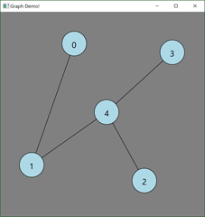
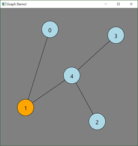
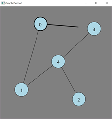
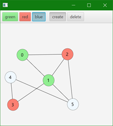
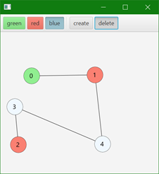

# CS3035 Assignment 5: Model-View-Controller

Due: Friday, November 5, 11:55pm

Overview
--------

In this assignment, you will further demonstrate your ability to develop
applications that use the Model-View-Controller pattern. You will
develop a simple graph editor with multiple views, where the user can
interactively add to and manipulate objects from the graph.

**NOTE**: This assignment will best be accomplished by drawing on the canvas rather than using the Shape classes. 

Part 1: A Basic JavaFX Graph Editor
-----------------------------------

Build a simple GUI in JavaFX that allows the user to create and
manipulate a graph.

### Interface requirements

- A main panel with size 500x500; this is the area where the user will
    interact with the graph (see below)

- The main panel shows all graph vertices, labels, and edges

### Interaction requirements

- Clicking on the background of the main panel creates a new vertex, drawn as a blue circle with an integer label

- Clicking down on an existing vertex selects that vertex (shown by drawing the vertex in orange); dragging then moves the vertex. Releasing the mouse returns the vertex to blue.

- If the user Shift-Clicks a vertex, the vertex gets a thicker black border, and then when the user drags, an edge is drawn to the mouse location. If the user releases the mouse on another vertex, the edge is added to the graph (if the user releases on the background, the edge is discarded).

|  |  | |
|:---:|:---:|:---:|
|  Main graph view | User clicks on vertex 1 | User shift-clicks on vertex 0 then drags |

### Software requirements*:

- You must implement the system using Model-View-Controller, with
    correct separation between these components

- Create separate classes for the Model, the View, and the Controller,
    following the examples given in class and available on the examples repo

- Build the system using the following classes:
  - **Main:** JavaFX application class

  - **GraphModel**: Class to store the model

  - **Vertex**: Represents a vertex (circle) in the graph

  - **Edge:** Represents an edge in the graph

  - **GraphView:** A custom view for drawing the graph
  - **GraphViewController:** Controller for the GraphView

### Resources for part 1:
- MVCSquareDrawing - in Examples Repo
- GetNotifiedOfChangeInSimpleList in examples repo

Part 2: Adding Interface State 
-------------------------------

In the second part of the assignment you will extend your system from
part 1 to add the ability to make vertices of different colors and to
delete vertices.

## Additional interface and interaction requirements

- You will create a ToolBar in FXML, that contains two groups of ToogleButtons. One for colors to use when creating the Vertices, and one for actions to take (either to create Vertices and Edges, or to delete vertices).
   - There is a separator between both groups of buttons.
   - Buttons are colored corresponding to the resulting Vertex color.
- When in create mode the interface behaves as in Part 1, but additionally creates vertices of different colors.
- When in delete mode, the only action that can take place is that a vertex can be deleted.
   - When a vertex is deleted, other vertices are relabeled (see the images below).
   - All edges connected to the deleted vertex are also deleted (see
        the images below).

-   To make sure that delete mode is visible while in delete mode, the
    cursor should change to a crosshair while over any vertex, but
    appear normal otherwise.

### Additional software requirements

-   You must continue to implement the system using
    Model-View-Controller, with correct separation between these
    components, as best as possible.

-   You can add a Color instance variable to your Vertex class, if you
    don’t already have one.

-   You should add the following classes/fxml documents:

    -   **toolbar.fxml:** provides the toolbar view

    -   **ToolBarController:** the controller for the toolbar.

    -   **InteractionModel:** Stores the state of the interface that can
        queried by other classes.

-   You should update your existing classes to make use of the new
    classes appropriately

-   The GraphView and Toolbar can be added to the scene in a BorderPane

|  |  |
|:---:|:---:|

### Resources for Part 2
- How to change the cursor: <https://blog.idrsolutions.com/2014/05/tutorial-change-default-cursor-javafx/>
- ToggleButton Tutorial:
    <https://docs.oracle.com/javafx/2/ui_controls/toggle-button.htm>
- How to do ToggleButtons/Groups in FXML:
  - <https://stackoverflow.com/questions/34010509/adding-radiomenuitem-to-togglegroup-in-fxml>
  - <https://docs.oracle.com/javafx/2/ui_controls/toggle-button.htm>
  - <https://docs.oracle.com/javafx/2/api/javafx/scene/Cursor.html#TEXT>

Evaluation 
-----------

Marks will be given for producing a system that meets the requirements above, and compiles and runs without errors. Note that no late assignments will be allowed, and no extensions will be given without medical reasons or pre-agreed arrangements.
